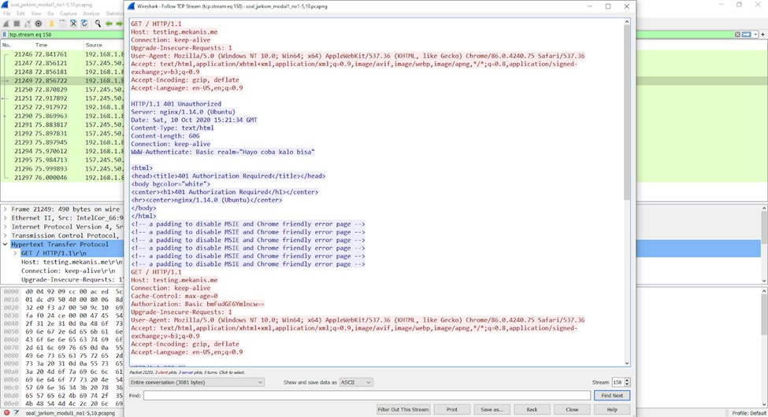
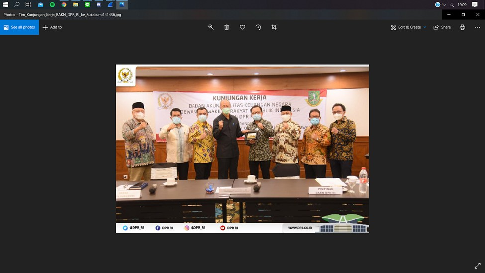
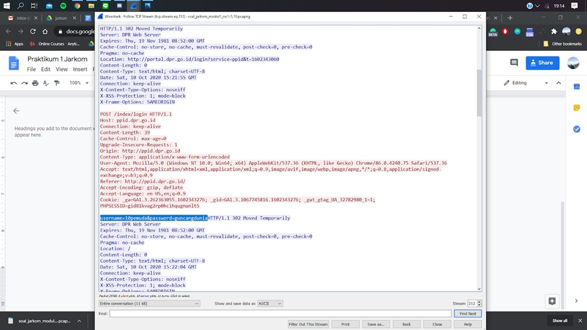
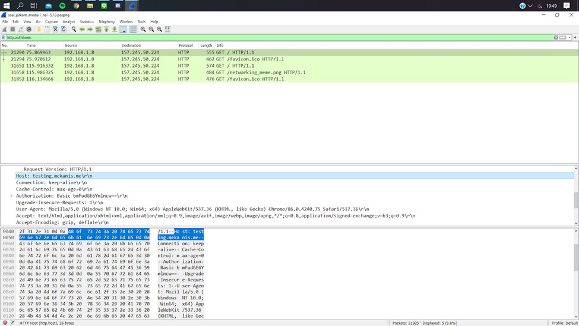
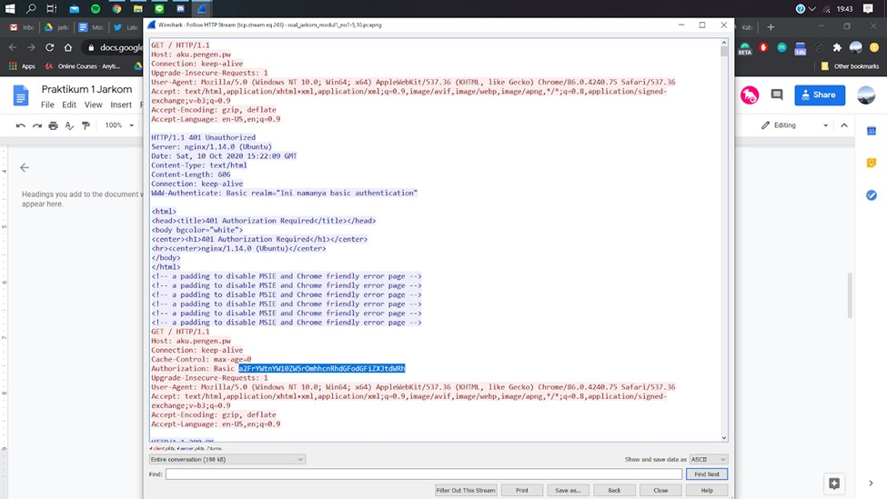
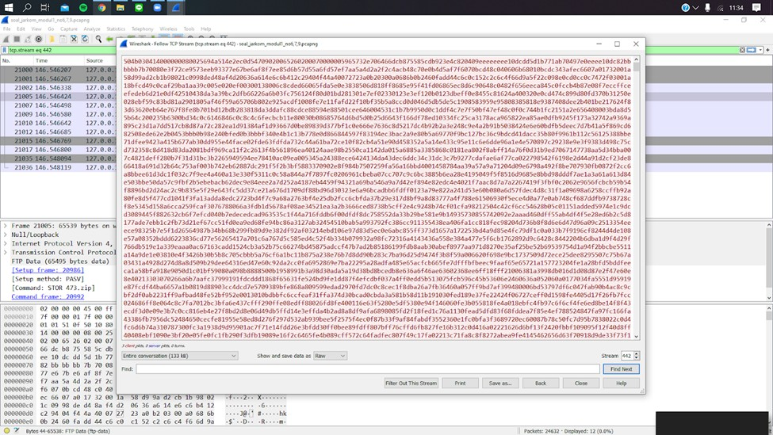

# Jarkom_Modul1_LaporanResmi_B01

#### A. Display Filter

1. Sebutkan webserver yang digunakan pada "testing.mekanis.me"!

`http contains "testing.mekanis.me" -> follow TCP stream`

2. Simpan gambar "Tim_Kunjungan_Kerja_BAKN_DPR_RI_ke_Sukabumi141436.jpg"!

`file -> export object -> http -> text filter: tim -> save as`

3. Cari username dan password ketika login di "ppid.dpr.go.id"!

`http contains "ppid.dpr.go.id" && http.request.method == POST`

4. Temukan paket dari web-web yang menggunakan basic authentication method!

`http.authbasic`

5. Ikuti perintah di aku.pengen.pw! Username dan password bisa didapatkan dari file .pcapng!

`http contains "aku.pengen.pw"`

6. Seseorang menyimpan file zip melalui FTP dengan nama "Answer.zip". Simpan dan Buka file "Open This.pdf" di Answer.zip. Untuk mendapatkan password zipnya, temukan dalam file zipkey.txt (passwordnya adalah isi dari file txt tersebut).

`ftp-data -> ctrl + f answer.zip -> follow TCP stream -> raw -> save as`
`ftp-data -> ctrl + f zipkey.txt -> follow TCP stream`

7. Ada 500 file zip yang disimpan ke FTP Server dengan nama 1.zip, 2.zip, ..., 500.zip. Salah satunya berisi pdf yang berisi puisi. Simpan dan Buka file pdf tersebut.
Your Super Mega Ultra Rare Hint = nama pdf-nya "Yes.pdf"

`ftp-data contains "Yes.pdf" -> follow TCP stream -> raw -> save as`

8. Cari objek apa saja yang didownload (RETR) dari koneksi FTP dengan Microsoft FTP Service!
9. Cari username dan password ketika login FTP pada localhost!

`ftp.request.command == USER -> follow TCP stream`

10. Cari file .pdf di wireshark lalu download dan buka file tersebut!
clue: "25 50 44 46"

`ctrl + f hex-value 25 50 44 46 -> follow TCP stream -> raw -> save as`

#### B. Capture Filter

11. Filter sehingga wireshark hanya mengambil paket yang mengandung port 21!
Port 21 adalah port untuk FTP. Untuk memunculkannya dengan melakukan connecting dan taransfer file menggunakan FileZilla

`tcp.port == 21 || udp.port == 21`

`port 21`

12. Filter sehingga wireshark hanya mengambil paket yang berasal dari port 80!

`src port 80`

13. Filter sehingga wireshark hanya menampilkan paket yang menuju port 443!

`dst port 443`

14. Filter sehingga wireshark hanya mengambil paket yang berasal dari ip kalian!

`host 192.168.43.109`

15. Filter sehingga wireshark hanya mengambil paket yang tujuannya ke monta.if.its.ac.id!

`dst host monta.if.its.ac.id`

